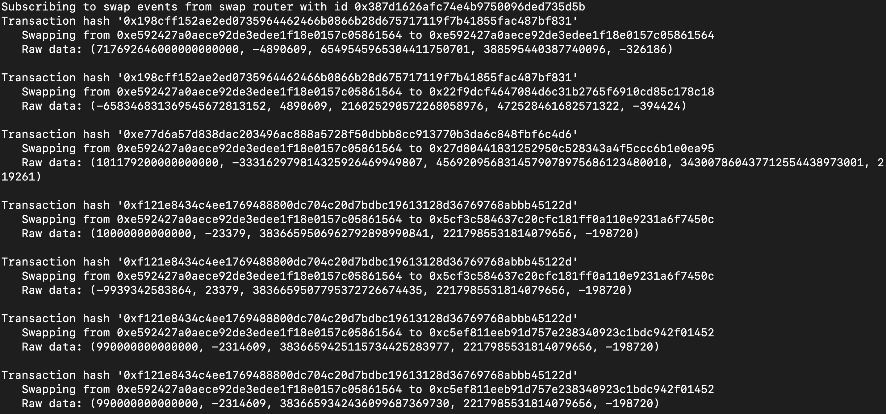

<!-- ABOUT THE PROJECT -->
## About The Project
This project is a demo on reading and filtering swap logs from the swap router

1. To set up the project:
  ```sh
  python -m venv .venv
  source .venv/bin/activate
  pip install wheel pip --upgrade
  pip install -r requirements.txt
  ```
2. Run it
  ```sh
  python main.py
  ```


Here is a screenshot of the demo!
